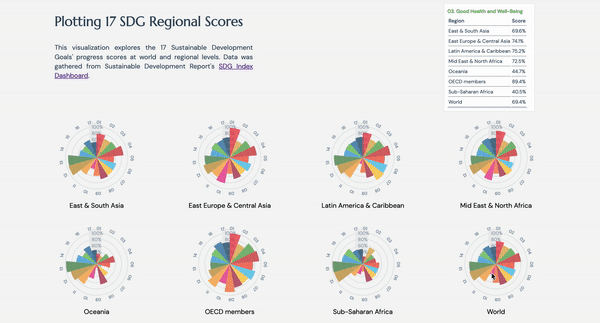

This mini dashboard is the first quantitative project in my Major Studio 1 class as part of the study of the MS Data Visualization progress. It looks into where the world is at according to goal by visualizing SDG progress scores at regional and global levels.

### Data

The data was obtained and aggregated from Sustainable Development Report's dashboard [meta database](https://dashboards.sdgindex.org/explorer).

### Prototype

Thanks to professor Richard The's guidance, I went through 3 rounds of iterations and eventually landed on small multiples with more nuanced tooltip functions for easy data comparison. The chart is built with d3.js and vanilla Javascript.

[Current Iteration](https://muons.com/msdv-major-studio-1/01_quantitative_project/v3)

In this iternation, I updated the hover-over logic so relevant information can be highlighted and irrelevant information muted and the overall readability has been improved.

### Previous versions

[Version 1](https://muons.com/msdv-major-studio-1/01_quantitative_project/v1)

In this first draft, I chose to visualize all regions on one circular bar graph with a filter of each SDG. However, later I deemed the visualization is inefficient and less readable.

[Version 2](https://muons.com/msdv-major-studio-1/01_quantitative_project/v2)

In the second iteration, I opted to use small multiples with multiple highlight points. Per professor Richard The's suggestions, I could further simplify the layout and highlight hover-over content and I improved the prototype further which led to the current iteration.

