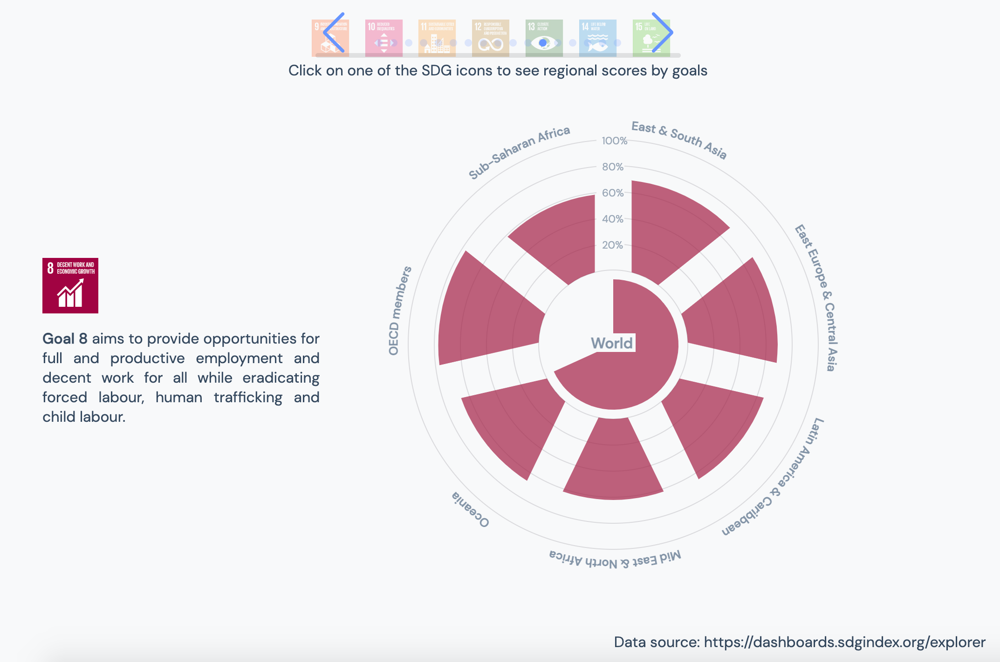
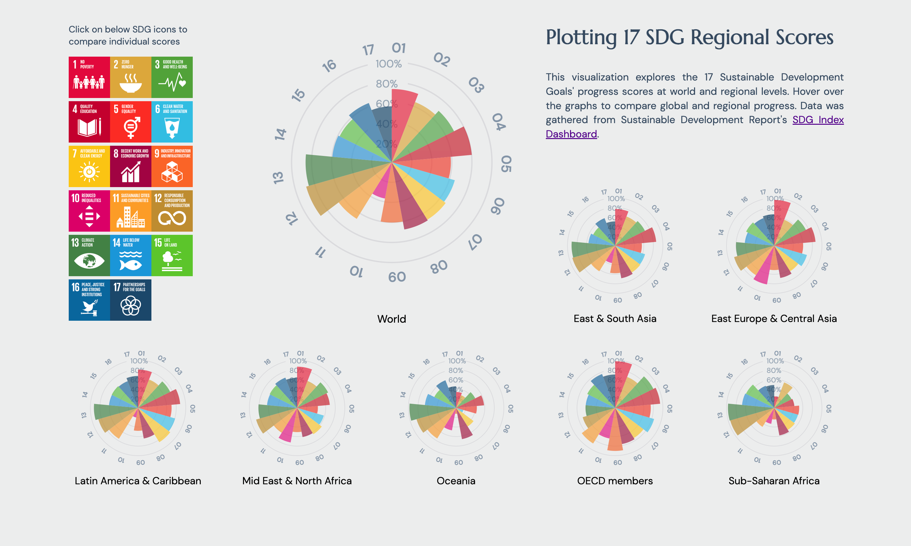

### Summary

This is my first quantitative project from the Major Studio 1 class. I wasn't happy with the [initial version](https://muons.com/msdv-major-studio-1/01_quantitative_project/v1) which is hard to draw insight from and visually not as cohesive. I decided to redo the project using small multiples and multiple interaction points.

[Version 1](https://muons.com/msdv-major-studio-1/01_quantitative_project/v1)

[Version 2](https://muons.com/msdv-major-studio-1/01_quantitative_project/v2)

### Process

1. Create a single Nightingale chart that features the scores of 17 SDGs
2. Create small multiples for 7 regions and the world
3. Use CSS grid to layout the small multiples and text components
4. Add mouseover interaction with a tooltip that embeds a table of data
5. Add mouse click interaction that highlights individual SDG scores when an SDG icon is clicked

### Learnings

It took me quite a while to figure out how to create the small multiples and I spent equal amount of time creating more sophisticated/comprehensive tooltips. However, I think these are valuable learnings for my future projects. At the end, I was happier with my second interation.

[Project Link](https://muons.com/msdv-major-studio-1/01_quantitative_project/v2)
