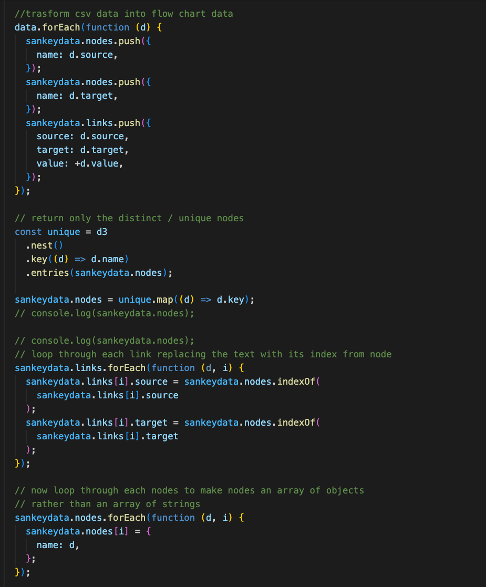
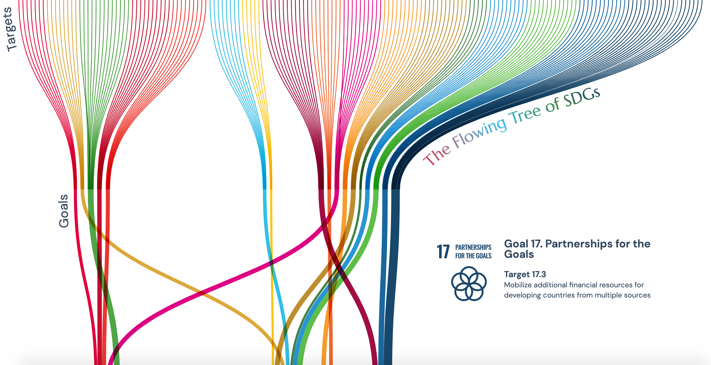

# Summary

I forwent the initial dendrogram design and tried to replicate the first concept from [Week 6's](https://github.com/muonius/msdv-major-studio-1/tree/master/week06_qualitative_sketches) design. To achieve the flow effect, I decided to experiment with Sankey diagram.

### Data Preparation

To change from dendrogram to Sankey diagram, I need to restructure the data from hierarchy data to flow data(nodes and links).
Here is the code I used to transform the data.

### Design Revision

I tried my best to replicate the sketched flow chart.

### Remaining Work

- Typography
- Tooltip formatting
- Tooltip responsive to window size
- Potentially add guidelines

[Project Link](https://muons.com/msdv-major-studio-1/02_qualitative_project/sankey)
