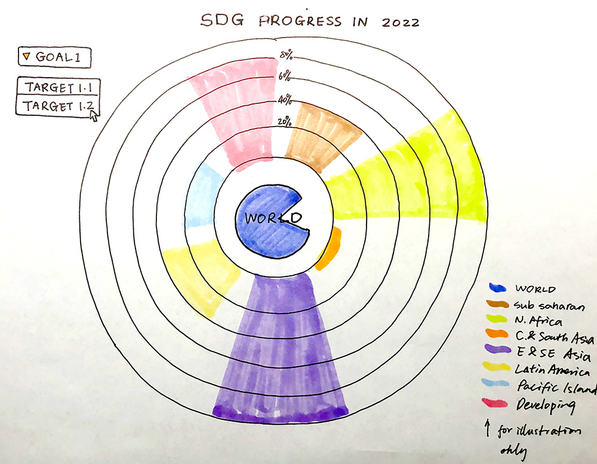
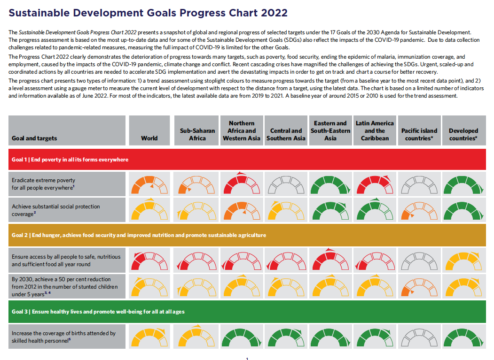
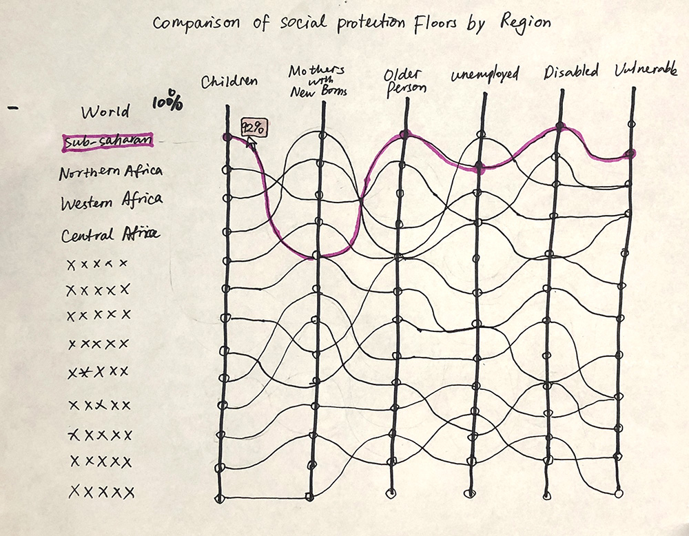
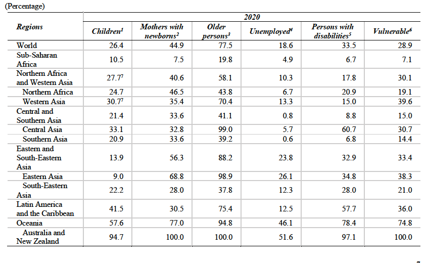
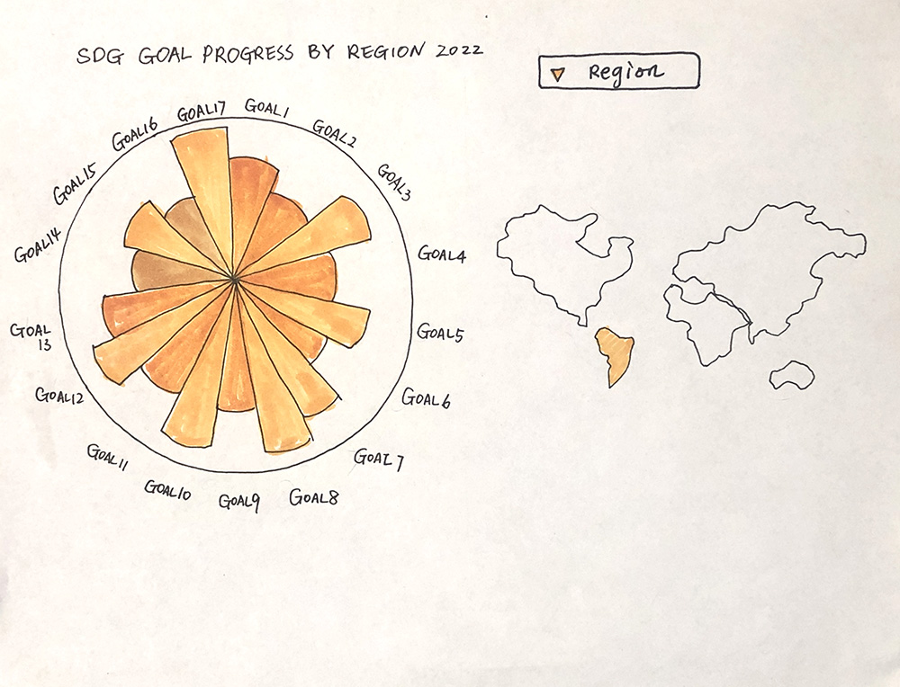

# Sketches
My overall goal is to provide a bird's eye view of the SDG progress so far either at goal level or regional level.   

### 1. SDG Progress in 2022

Visualize SDG progress made so far by all regions and the world as a whole; Users can toggle to zoom in on progress made for a particular SDG target.

- Dataset: Progress-Chart-2022

- Properties of the dataset: The dataset is about right size but data needs to be manually converted from an infographic of gauge charts.
- Visualization method: A sun burst chart is selected for comparison of different regions all in one chart. 

### 2. Comparison of Social Protection Floors by Region

Compare the proportion of population covered by social protection by groups of people in need at the regional level. 

- Dataset: Indicator 1.3.1: Proportion of population covered by social protection floors/systems, by distinguishing children, unemployed persons, older persons, persons with disabilities, and the vulnerable.

- Properties of the dataset: The dataset is about the right size.
- Visualization method: Curved parallel coordinate plot is selected for showing overall trends while allowing highlighting trends in individual regions. 

### 3. SDG Progress in 2022 by Region

Visualize all SDG Goal scores so far by each region.

- Dataset: Progress-Chart-2022
- Properties of the dataset: The dataset is about right size but data needs to be manually converted and averaged out.
- Visualization method: A nightingale rose chart is selected for comparison of different goals by each region.  

