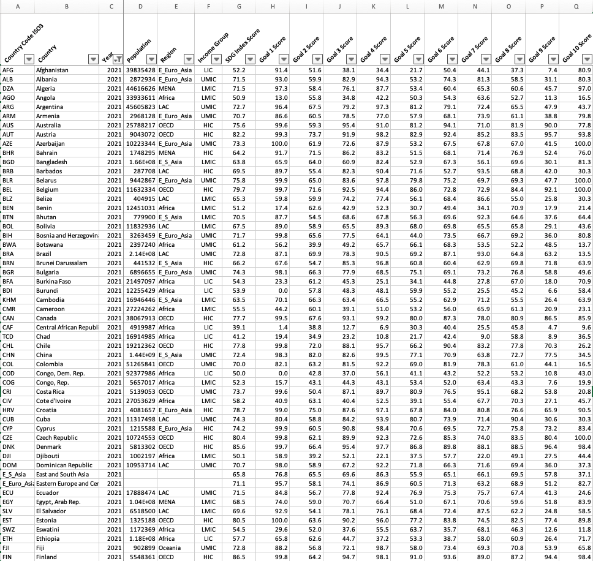
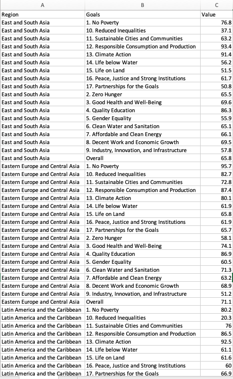
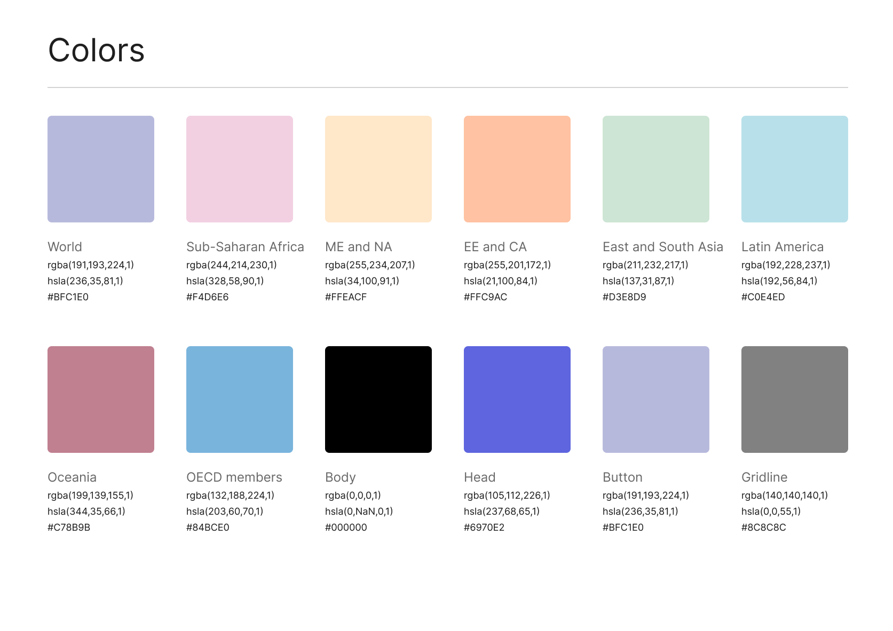
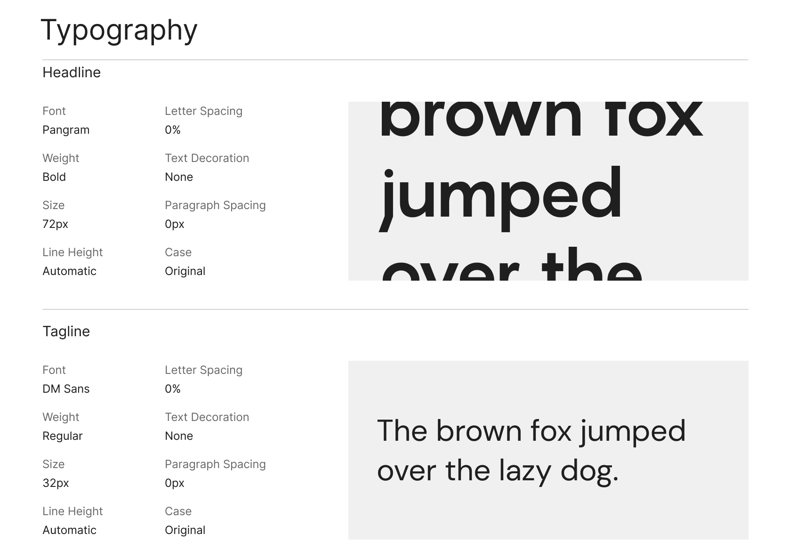
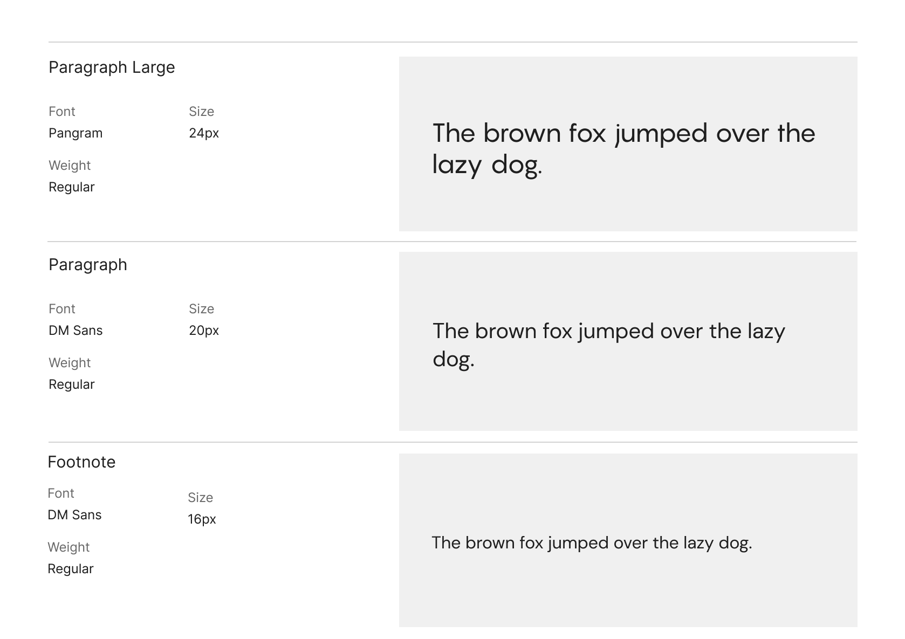
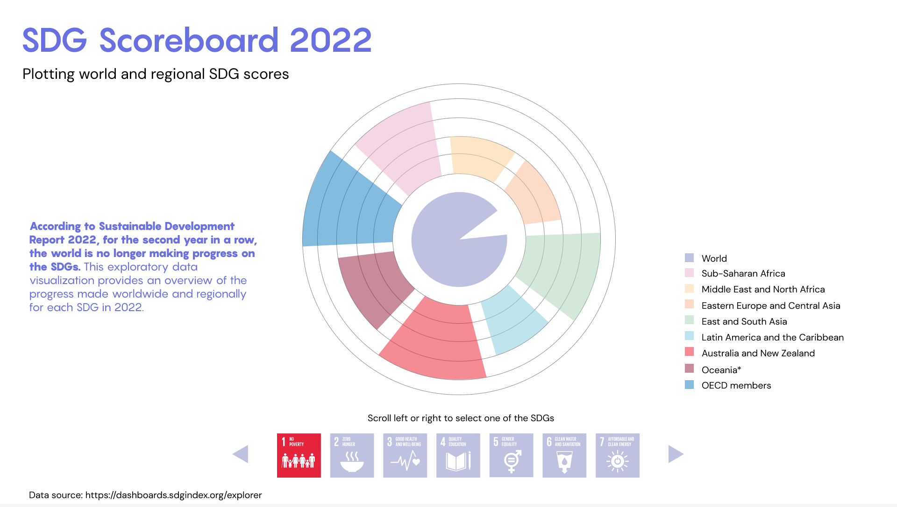

# Summary
I picked the first concept from my sketches from [Week 3](https://github.com/muonius/msdv-major-studio-1/tree/master/week03_sketches). The first concpet will be further developed and integrated into a more comprehensive, interactive dashboard.

Upon further research, I located a historical database from Sustainable Development Report's [Data Explorer](https://dashboards.sdgindex.org/explorer). In the downloadable database, it breaks down individual country's SDG score by individual goals and I decided to use this database as source of my visualization.

### Data Preparation

Original Data:

Cleaned Data:
I summarized the data at regional level and standardized naming convention. 

### Design Mockup - SDG Scoreboard 2022

#### Style Guide

To prevent the dashboard becoming too colorful, I chose a muted pastel color palette.

#### Mockup

The design done in [Figma](https://www.figma.com/file/cC6Yy4gIl6kkQTa3xYLleT/Major-Studio-1-Quantitative-Visualization?node-id=0%3A1) is centered around a sunburst chart with a horizontal scroll bar at the bottom. By clicking on individual goals in the scroll bar, the user can have an overview of the scores of each region with the world's score in the middle. 

### Current Prototype

I coded the basic composition of the sunburst chart in d3.js. I also break down what I need to do next in the following list.

- Score grid rating
- Legend
- Text
- Hover over tooltip
- Generalize the code so user can toggle different goal metric
- Change the toggle to a horizontal scroll*
- Highlight goal selected and mute unselected ones*

*are nice to have features

[Project Link](http://muons.com/msdv-ms1-quantitative/)