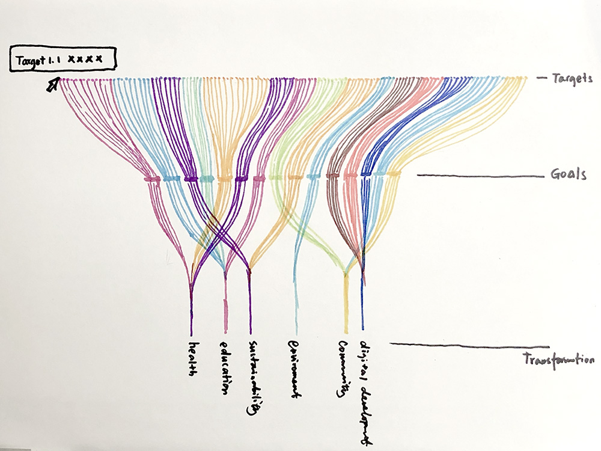
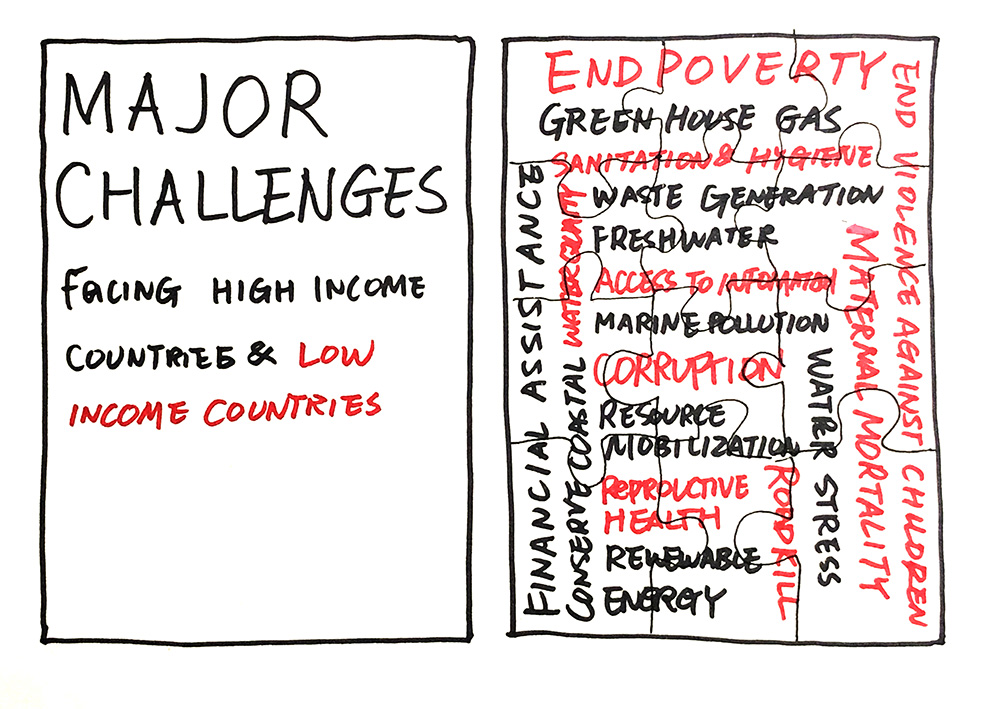
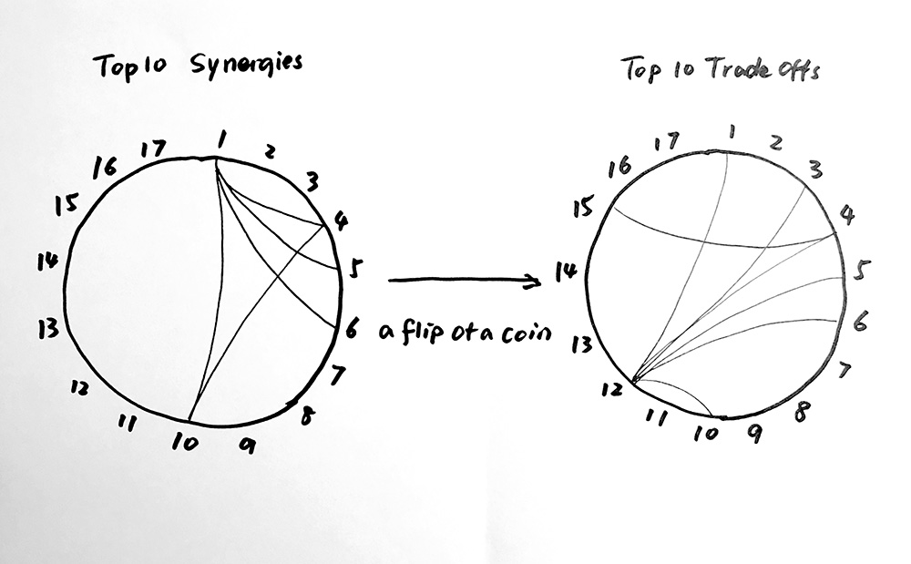

### 1. Mapping 6 Transformations, 17 Goals and 169 Targets

Visualize SDG transformation priorities, goals and targets in one flow chart.

- This visualization is intended to display large amount of qualitative information in an organized, simple format while highlighting hierarchy and structure.
- Properties of the dataset: The dataset is about right size but data needs to be manually condensed and transformed into a CSV or JSON file.
- Visualization method: A tiered flow chart.

### 2. Major Challenges Facing High Income Countries and Low Income Countries

- This visualization is intended to call to attention that challenges facing high income countries and low income countries are intertwined and need to be addressed in a collabroative matter.
- Properties of the dataset: The dataset is slightly smaller in size.
- Visualization method: The visualization resembles a typography poster with the challenges broken down into a jigsaw puzzle. The viewers need to piece the puzzle together, a process intended to remind them that challenges are interconnected and to achieve SDGs, no one should be left behind.

### 3. SDG Synergies and Tradeoffs

- This visualization is intended to depict the synergies and tradeoffs between SDGs.
- Properties of the dataset: The dataset is slightly smaller in size.
- Visualization method: Chord charts with a flip of a coin visual effect to highlight both synergies and tradeoffs.
