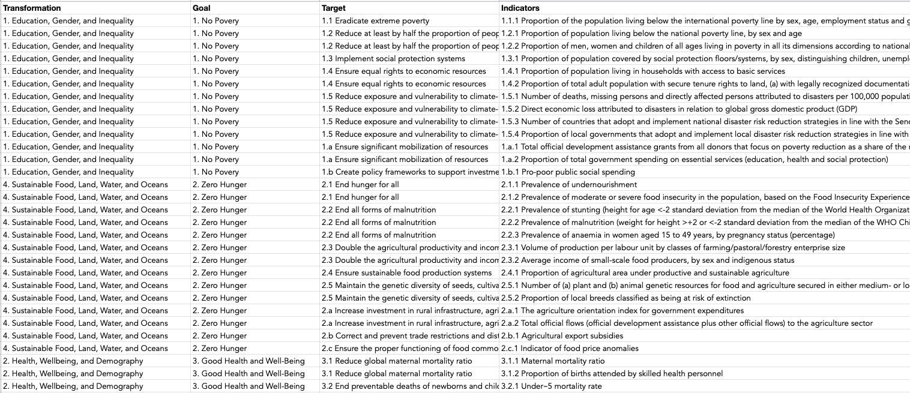
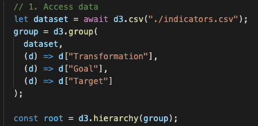
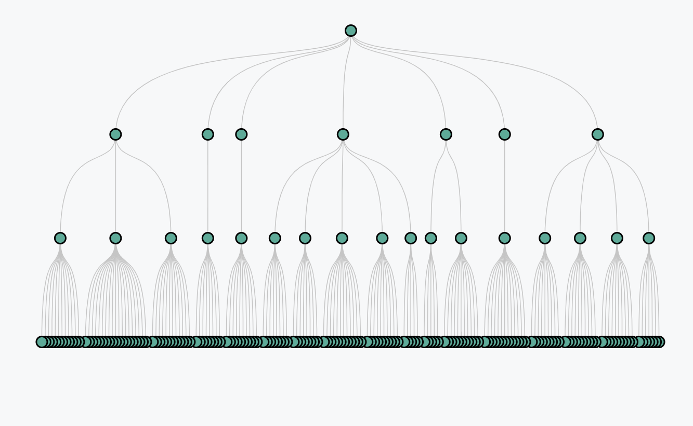
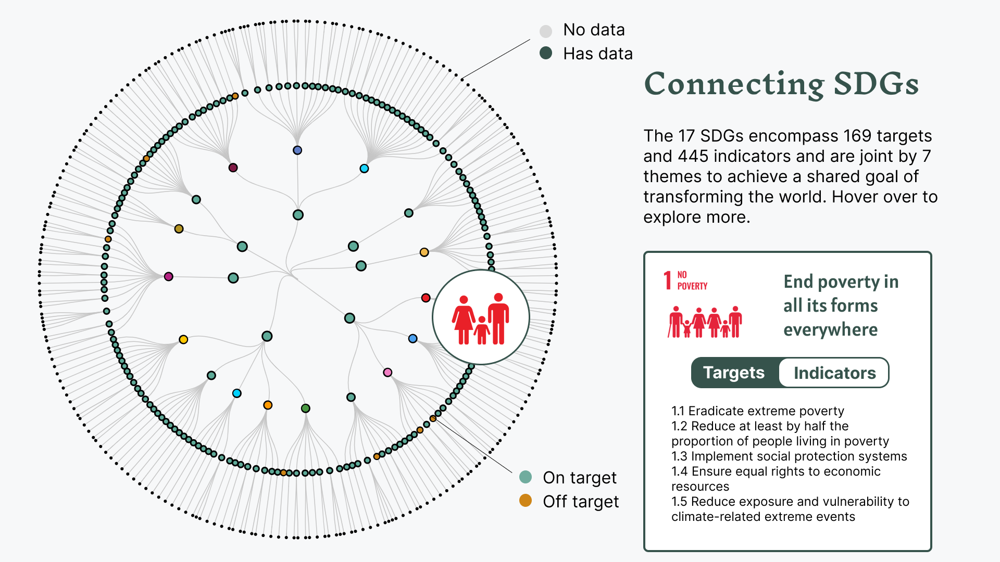

# Summary
 I picked the first concept, a dendrogram flowchart, from my sketches from [Week 6](https://github.com/muonius/msdv-major-studio-1/tree/master/week06_qualitative_sketches). The first concpet will be further developed and integrated into a more comprehensive, interactive dashboard.

### Data Preparation

Original Data: The original data was manually compossed in tabular format.

Cleaned Data: To create the dendrogram chart, I need to create hierarchy for the tabular data and I used d3 to convert the data.

### Design Mockup
Inspired by Mortiz Stephaner's [Notabilia](https://notabilia.net/) project, I wanted to create a somewhat organic tree structure. However, I was not particularly happy with the horizontal layout.

### Design Revision

I settled with a circular dendogram.

### Current Prototype

I coded the basic composition of the dendrogram chart in d3.js. I also break down what I need to do next in the following list.

- Add status data
- Color code status
- Add icons to hover over
- Hover over tooltip
- Side bar contents

[Project Link](https://muons.com/msdv-major-studio-1/02_qualitative_project/)